# サンプルプロジェクト ソースコード

## 概要

[Spring Boot](https://spring.io/projects/spring-boot)をベースにしたサンプルコードです。

ドメインバリデーションやコード管理、業務日付管理を行うため一部で[Nablarch](https://nablarch.github.io/docs/5u21/doc/)のライブラリを組み込んで使用しています。
これらの機能はゼロから作るのではなく、Nablarchが提供している高品質な成果物を再利用することにしました。

## 構成

以下のMavenプロジェクトから構成されています。

- `parent`
- `common`
- `web`
- `api`
- `batch`

`parent`は他のすべてのMavenプロジェクトの親となっています。
`common`は共通的に使用できるものが格納されており、`web`、`api`、`batch`から依存されています。

各Mavenプロジェクトの関係性を図に表すと次の通りです。



また、`web`は一部の機能で`api`のエンドポイントを参照しているものがあります。
`web`を動作させる際は`api`も起動しておいてください。

## 開発の準備

まずDBを起動します。
Docker Composeで起動できるようにしています。

```bash
docker compose up -d
```

次に[parentのREADME](./parent/README.md)に従って、parentをローカルのMavenリポジトリへインストールします。

更に[commonのREADME](./common/README.md)に従って、DBのセットアップとModelの自動生成を行って、commonをローカルのMavenリポジトリへインストールします。

## Web、API、バッチの起動方法

各Mavenプロジェクトの`README.md`を参照してください。

- [Web](./web/README.md)
- [API](./api/README.md)
- [バッチ](./batch/README.md)

## 参考情報

このサンプルでは次に示す[Springアプリ開発ノウハウ集](https://fintan-contents.github.io/spring-crib-notes/latest/html/index.html)のノウハウを使用しています。

- [二重送信防止](https://fintan-contents.github.io/spring-crib-notes/latest/html/web/double-submission/index.html)
- [SpringからNablarchの機能を利用する際のノウハウ](https://fintan-contents.github.io/spring-crib-notes/latest/html/nablarch/index.html)
 
