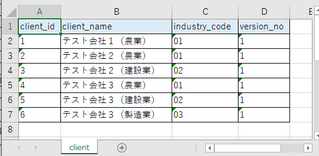

# 単体テストガイド(API)

- [テスト単位](#テスト単位)
- [テスト実施方法](#テスト実施方法)
  - [テストデータ作成](#テストデータ作成)
    - [テストデータの配置場所](#テストデータの配置場所)
    - [データベース (テスト実施前)](#データベース-テスト実施前)
    - [SQLファイル (テスト実施前)](#sqlファイル-テスト実施前)
    - [データベース (期待値)](#データベース-期待値)
    - [入力値（リクエスト)](#入力値リクエスト)
    - [期待値（レスポンス)](#期待値レスポンス)
  - [テストコード作成](#テストコード作成)
    - [モジュール単位の自動テスト](#モジュール単位の自動テスト)
    - [画面・バッチ単位の自動テスト](#画面バッチ単位の自動テスト)

## テスト単位

APIの単体テストは自動テストで実施する。
1つの【030_アプリ設計/110_テスト仕様書/単体テスト仕様書】につき1つのテストクラスを作成する。
可読性を向上させるため、なるべく1つのテストメソッドにつき1つのテスト観点のみを確認するよう実装すること。

## テスト実施方法

### テストデータ作成

#### テストデータの配置場所

テストデータは`src/test/resources`の配下に配置する。
`[テスト対象のパッケージ階層]/[テストクラス名]/[テストメソッド名]`というディレクトリを作成しテストデータを配置する。
複数のテストメソッドで共通で利用したいテストデータについては、`[テスト対象のパッケージ階層]/[テストクラス名]`に配置する。

`com.example.api.client.controller.ClientCreateController`という`RestController`をテストする`ClientCreateControllerTest`というテストクラスの`testSuccess`というテストメソッドの場合、テストデータは以下のように配置する。

```shell
src
  ├ main
  │   └ java
  │       └ com
  │           └ example
  │               └ api
  │                   └ client
  │                       └ controller
  │                           └ ClientCreateController           #テスト対象のRestController
  └ test
      └ resources
           └ com
               └ example
                   └ api
                       └ client
                           └ controller
                               └ ClientCreateControllerTest        #テストクラス名
                                   ├ testSuccess                   #テストメソッド名
                                   │   ├ testSuccess.xlsx          #テストデータ
                                   │   ├ request.json              #テストデータ
                                   │   ├ expected.json             #テストデータ
                                   │   └ expected-testSuccess.xlsx #テストデータ
                                   └ reset_sequence_val.sql        #テストデータ(共通)
```

#### データベース (テスト実施前)

データベースをセットアップする必要がある場合に作成する。
テストデータは[Database Rider](https://database-rider.github.io/database-rider/)というツールによってデータベースに投入される。

- `client`テーブルをセットアップするテストデータの例。

    

    - テストデータ作成のポイント
        - Excelで作成する
        - 全セル文字列形式とする
        - ファイル名は`[対象のテストメソッド名].xlsx`とする
        - 1シートにつき1テーブルずつデータを記載し、シート名はテーブル名とする
        - 各シートの1行目にはカラム名を記載する
        - カラムを省略した場合はそのカラムの値は`null`となる
        - 項目に`null`を設定したい場合は、`[null]`と入力する

#### SQLファイル (テスト実施前)

テスト実行前に実行したいSQLが存在する場合に作成する。
シークエンスのリセットのためALTER文を発行したい場合などに使用する。

- SQLファイル(テスト実施前)の例

    ```sql
    alter sequence public.client_client_id_seq restart with 7;
    ```

    - SQLファイル作成のポイント
        - ファイル名は、内容が分かるように命名する

#### データベース (期待値)

テスト実施後のデータベースの状態を検証する場合に作成する。
テストデータは[Database Rider](https://database-rider.github.io/database-rider/)というツールによって検証される。

- `client`テーブルを検証するテストデータの例。

    

    - テストデータ作成のポイント
        - Excelで作成する
        - 全セル文字列形式とする
        - ファイル名は`expected-[対象のテストメソッド名].xlsx`とする
        - 1シートにつき1テーブルずつデータを記載し、シート名はテーブル名とする
        - 各シートの1行目にはカラム名を記載する
        - カラムを省略した場合はそのカラムは検証対象外となる
        - 項目に`null`を設定したい場合は、`[null]`と入力する

#### 入力値（リクエスト)

リクエストとして送信するデータがある場合に作成する。

- 入力値(リクエスト)の例

    ```json
    {
        "clientName": "正常系テスト",
        "industryCode": "01"
    }
    ```

    - テストデータ作成のポイント
        - JSONファイルとして作成する
        - ファイル名は`request.json`とする

#### 期待値（レスポンス)

レスポンスとして返却されるデータを検証する場合に作成する。

- 期待値(レスポンス)の例

    ```json
    {
        "clientId": 7,
        "clientName": "正常系テスト",
        "industryCode": "01",
        "versionNo": 1
    }
    ```

    - テストデータ作成のポイント
        - JSONファイルとして作成する
        - ファイル名は`expected.json`とする

### テストコード作成

#### モジュール単位の自動テスト

モジュール単位のテストの対象は本プロジェクトでは【030_アプリ設計/020_共通コンポーネント設計/共通コンポーネント設計書】を作成したクラスとなる。

- モジュール単位の自動テストの実装例

    ```java
    @SpringBootTest // (1)
    @DBRider // (2)
    @DBUnit(replacers = {SystemDateTextReplacer.class}, cacheConnection = false, caseSensitiveTableNames = true) // (2)
    @ApiTest // (3)
    class ExampleCommonServiceTest {
        private static final String BASE_PATH = "com/example/api/service/ExampleCommonServiceTest/";
        
        @Autowired // (4)
        ExampleCommonService sut;

        @Test
        @DataSet(BASE_PATH + "testCommonMethod/testCommonMethod.xlsx") // (5)
        @ExpectedDataSet(BASE_PATH + "testCommonMethod/expected-testCommonMethod.xlsx") // (6)
        void testCommonMethod(){ // (7)
            // (8)
        }
    }
    ```

    - 実装のポイント
        - (1)`@SpringBootTest`をつける。これによりテスト対象のコンポーネントをテストクラスにインジェクションできるようになる
        - (2)データベースのセットアップ/検証を行う場合は`@DBRider`と`@DBUnit(replacers = {SystemDateTextReplacer.class}, cacheConnection = false, caseSensitiveTableNames = true)`をつける
        - (3)テスト用の不要なクラスが起動されないように`@ApiTest`をつける
        - (4)テスト対象のコンポーネントをインジェクションする
        - (5)データベースのセットアップを行うには`@DataSet`をつける。[データベース (テスト実施前)](#データベース-テスト実施前)で作成したテストデータを`src/test/resources`からの相対パスで指定する
        - (6)データベースの検証を行うには`@ExpectedDataSet`をつける。[データベース (期待値)](#データベース-期待値)で作成したテストデータを`src/test/resources`からの相対パスで指定する
        - (7)テストメソッド名は「`test` + テストで確認している観点がわかる論理的な名前」とする
        - (8)【030_アプリ設計/110_テスト仕様書/単体テスト仕様書】のケースに沿ってテストコードを実装する

#### 画面・バッチ単位の自動テスト

- 画面・バッチ単位の自動テストの実装例

    ```java
    @SpringBootTest(webEnvironment = WebEnvironment.RANDOM_PORT) // (1)
    @DBRider // (2)
    @DBUnit(replacers = {SystemDateTextReplacer.class}, cacheConnection = false, caseSensitiveTableNames = true) // (2)
    @ApiTest // (3)
    class ClientCreateControllerTest extends RestControllerTestBase { // (4)
        
        private static final String BASE_PATH = "com/example/api/client/controller/ClientCreateControllerTest/";

        @Test
        @DataSet(value = BASE_PATH + "testCreateClient/testCreateClient.xlsx"
                , executeScriptsBefore = BASE_PATH + "reset_sequence_val.sql") // (5)
        @ExpectedDataSet(BASE_PATH + "testCreateClient/expected-testCreateClient.xlsx") // (6)
        void testCreateClient() throws JSONException { // (7)
            RequestEntity<String> request = RequestEntity.post("/clients")
                    .contentType(MediaType.APPLICATION_JSON)
                    .body(read("testCreateClient/request.json")); // (8)
            ResponseEntity<String> response = http.exchange(request, String.class); // (9)
            assertEquals(HttpStatusCode.CREATED, response.getStatusCode()); // (10)
            assertThat(forJson(response.getBody()))
                    .isStrictlyEqualToJson(read("testCreateClient/expected.json")); // (11)
        }
    }
    ```

    - 実装のポイント
        - (1)`@SpringBootTest(webEnvironment = WebEnvironment.RANDOM_PORT)`をつける。これによりアプリケーションが起動しHTTPリクエストを受け取れるようになる
        - (2)データベースのセットアップ/検証を行う場合は`@DBRider`と`@DBUnit(replacers = {SystemDateTextReplacer.class}, cacheConnection = false, caseSensitiveTableNames = true)`をつける
        - (3)テスト用の不要なクラスが起動されないように`@ApiTest`をつける
        - (4)`RestControllerTestBase`を継承する。これにより入力値・期待値のJSONファイルを簡易に読み込むメソッドとHTTPクライアントとして`TestRestTemplate`が利用できる
        - (5)データベースのセットアップを行うには`@DataSet`をつける。[データベース (テスト実施前)](#データベース-テスト実施前)で作成したテストデータを`src/test/resources`からの相対パスで指定する
            - 追加でSQLを実行する場合は`executeScriptsBefore`に、[SQLファイル (テスト実施前)](#sqlファイル-テスト実施前)で作成したファイルを`src/test/resources`からの相対パスで指定する
        - (6)データベースの検証を行うには`@ExpectedDataSet`をつける。[データベース (期待値)](#データベース-期待値)で作成したテストデータを`src/test/resources`からの相対パスで指定する
        - (7)テストメソッド名は「`test` + テストで確認している観点がわかる論理的な名前」とする
        - (8)[RequestEntity](https://docs.spring.io/spring-framework/docs/6.1.x/javadoc-api/org/springframework/http/RequestEntity.html)を使ってリクエストを生成する。リクエストボディには[入力値 (リクエスト)](#入力値リクエスト)で作成したJSONファイルを`RestControllerTestBase#read`で読み込み設定する
        - (9)`TestRestTemplate`を使ってHTTPリクエストを実行しレスポンスを受け取る。`TestRestTemplate`は`RestControllerTestBase`に`http`という名前で定義されている
        - (10)レスポンスのHTTPステータスコードを検証する
        - (11)レスポンスボディを検証する。[期待値（レスポンス)](#期待値レスポンス)で作成したJSONファイルを`RestControllerTestBase#read`で読み込みレスポンスボディと一致するか比較検証する。検証には[AssertJ](https://assertj.github.io/doc/)というライブラリを使用している
