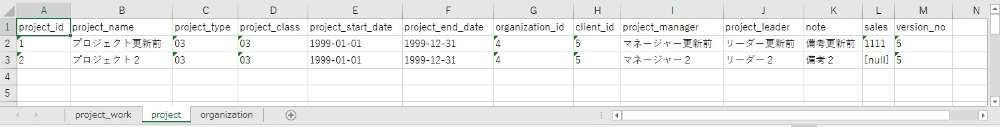

# 単体テストガイド(バッチ)

- [テスト単位](#テスト単位)
- [テスト実施方法](#テスト実施方法)
  - [テストクラス作成](#テストクラス作成)
  - [テストデータ作成](#テストデータ作成)
    - [テストデータの配置場所](#テストデータの配置場所)
    - [データベース (テスト実施前)](#データベース-テスト実施前)
    - [SQLファイル (テスト実施前)](#sqlファイル-テスト実施前)
    - [CSVファイル (取込対象)](#csvファイル-取込対象)
    - [データベース (期待値)](#データベース-期待値)
    - [CSVファイル (期待値)](#csvファイル-期待値)
  - [テストコード作成](#テストコード作成)
    - [バッチ処理のテストコード](#バッチ処理のテストコード)
    - [CSVファイル取込のテストコード](#csvファイル取込のテストコード)
    - [CSVファイル出力のテストコード](#csvファイル出力のテストコード)
    - [ログ出力のテストコード](#ログ出力のテストコード)
    - [業務日付を扱う場合のテストコード](#業務日付を扱う場合のテストコード)
    - [取引単体テストのテストコード](#取引単体テストのテストコード)
    - [システム日付のテストコード](#システム日付のテストコード)

## テスト単位

バッチでは、バッチ処理ごとの単体テストと取引単体でのテストを行う。
ただし、バッチ処理が1つだけで構成されるバッチの場合は、取引単体テストは行わない。
これらのテストは、自動テストで実施する。

【030_アプリ設計/110_テスト仕様書/単体テスト仕様書】はバッチ処理ごとに1シート、取引単体テスト用に1シートで構成されている。
これらのシート1つごとに、1つのテストクラスを作成する。

可読性を向上させるため、なるべく1つのテストメソッドにつき1つのテスト観点のみを確認するよう実装すること。

## テスト実施方法

### テストクラス作成

テストクラスは、`src/test/java`の配下に作成する。
このとき、パッケージは`<ドメイン>.<機能>`とする。

バッチ処理ごとの単体テストのクラス名は、テスト対象のバッチ処理を定義した`Config`の、末尾を`Config`から`Test`に変更したものにする。
取引単体テストのクラス名は、論理的な名前またはバッチ処理IDを元にした名前に、接尾辞`IntegrationTest`を付けたものにする。

以下に例を示す。

```shell
src
  ├ main
  |   └ java
  |       └ com
  |           └ example
  |               └ batch
  |                   └ project
  |                       └ configuration
  |                           | ImportProjectsToWorkConfig.java  # テスト対象のバッチ処理のConfig
  |                           └ ImportProjectsConfig.java        # テスト対象のバッチ処理のConfig
  └ test
      └ java
          └ com
              └ example
                  └ batch
                      └ project
                          | ImportProjectsIntegrationTest.java   # 取引単体テストクラス
                          | ImportProjectsToWorkTest.java        # バッチ処理の単体テストクラス
                          └ ImportProjectsTest.java              # バッチ処理の単体テストクラス
```

上記例では、テスト対象のバッチ処理の`Config`として`ImportProjectsToWorkConfig`と`ImportProjectsConfig`の2つがあり、対応する単体テストクラスとして`ImportProjectsToWorkTest`と`ImportProjectsTest`の2つを作成している。
また、取引単体テストのクラスとして`ImportProjectsIntegrationTest`を作成している。


### テストデータ作成

#### テストデータの配置場所

作成するテストデータは`src/test/resources`の配下に配置する。
`[テスト対象のパッケージ階層]/[テストクラス名]/[テストメソッド名]`というディレクトリを作成し作成したテストデータを配置する。
複数のテストメソッドで共通で利用したいテストデータについては、`[テスト対象のパッケージ階層]/[テストクラス名]`に配置する。

`com.example.batch.project.ImportProjectsToWorkTest`というテストクラスの`testNormal`というテストメソッドの場合、テストデータは以下のように配置する。

```shell
src
  └ test
      └ resources
           └ com
               └ example
                   └ batch
                       └ project
                            └ ImportProjectsTest                 #テストクラス名
                                ├ testNormal                     #テストメソッド名
                                |   ├ testNormal.xlsx            #テストデータ
                                |   ├ input.csv                  #テストデータ
                                |   └ expected-testNormal.xlsx   #テストデータ
                                └ reset_sequence_val_project.sql #テストデータ(共通)
```

#### データベース (テスト実施前)

データベースをセットアップする必要がある場合に作成する。
テストデータは[Database Rider](https://database-rider.github.io/database-rider/)というツールによってデータベースに投入される。

- `project`テーブルをセットアップするテストデータの例

    

    - テストデータ作成のポイント
        - Excelで作成する
        - 全セル文字列形式とする
        - ファイル名は`[対象のテストメソッド名].xlsx`とする
        - 1シートにつき1テーブルずつデータを記載し、シート名はテーブル名とする
        - 各シートの1行目にはカラム名を記載する
        - カラムを省略した場合はそのカラムの値は`null`となる
        - 項目に`null`を設定したい場合は、`[null]`と入力する

#### SQLファイル (テスト実施前)

テスト実行前に実行したいSQLが存在する場合に作成する。
シークエンスのリセットのためALTER文を発行したい場合などに使用する。

- SQLファイル(テスト実施前)の例

    ```sql
    alter sequence public.project_project_id_seq restart with 7;
    ```

    - SQLファイル作成のポイント
      - ファイル名は、内容が分かるように命名する

#### CSVファイル (取込対象)

CSVファイルの取込機能を持つバッチ処理をテストする場合に作成する。

- CSVファイル(取込対象)の例

    ```csv
    1,プロジェクト１,01,02,2020/01/01,2020/12/31,2,3,プロジェクトマネージャ１,プロジェクトリーダー１,備考１,1234
    ```

    - テストデータ作成のポイント
        - ファイル名は`input.csv`とする


#### データベース (期待値)

テスト実施後のデータベースの状態を検証する場合に作成する。
テストデータは[Database Rider](https://database-rider.github.io/database-rider/)というツールによって検証される。

- `project`テーブルを検証するテストデータの例

    

    - テストデータ作成のポイント
        - Excelで作成する
        - 全セル文字列形式とする
        - ファイル名は`expected-[対象のテストメソッド名].xlsx`とする
        - 1シートにつき1テーブルずつデータを記載し、シート名はテーブル名とする
        - 各シートの1行目にはカラム名を記載する
        - カラムを省略した場合はそのカラムは検証対象外となる
        - 項目に`null`を設定したい場合は、`[null]`と入力する

#### CSVファイル (期待値)

CSVファイルの出力機能を持つバッチ処理をテストする場合に作成する。

- CSVファイル(期待値)の例

    ```csv
    4,テストプロジェクト４,04,08,2019/01/01,2020/01/01,13,24,プロジェクト管理者４,プロジェクトリーダー４,期間内（終了日付＝業務日付）,4566,34
    2,テストプロジェクト２,02,06,2020/01/01,2020/12/31,11,22,プロジェクト管理者２,プロジェクトリーダー２,期間内（業務日付＝開始日付）,2345,32
    ```

    - テストデータ作成のポイント
        - ファイル名は`expected.csv`とする


### テストコード作成

#### バッチ処理のテストコード

```java
@BatchTest // (1)
@SpringBootTest // (1)
@DBRider // (2)
@DBUnit(replacers = {SystemDateTextReplacer.class}, cacheConnection = false, caseSensitiveTableNames = true) // (2)
public class ImportProjectsTest extends BatchTestBase { // (3)
    private static final String BASE_PATH = "com/example/batch/project/ImportProjectsTest";

    @Autowired // (4)
    ImportProjectsConfig config; // (4)

    JobParameters jobParameters = jobParametersBuilder().toJobParameters(); // (5)

    @Test
    @DataSet( // (6)
        value = BASE_PATH + "/testNormalInsert/testNormalInsert.xlsx", // (6)
        executeScriptsBefore = BASE_PATH + "/reset_sequence_val_project.sql" // (6)
    )
    @ExpectedDataSet(BASE_PATH + "/testNormalInsert/expected-testNormalInsert.xlsx") // (7)
    void testNormalInsert() throws Exception {
        jobLauncher.run(config.importProjectsJob(), jobParameters); // (8)
    }
}
```

- 実装のポイント
  - (1) バッチのテストクラスには`@BatchTest`と`@SpringBootTest`を設定する
  - (2) DBのセットアップや検証を行う場合は`@DBRider`と`@DBUnit(replacers = {SystemDateTextReplacer.class}, cacheConnection = false, caseSensitiveTableNames = true)`を設定する
  - (3) バッチのテストクラスは、`BatchTestBase`を継承すること
  - (4) テスト対象となるバッチ処理の`Config`をフィールドで定義して、`@Autowired`を付ける
  - (5) `BatchTestBase`に用意されている`jobParametersBuilder`メソッドを使って、`JobParameters`を生成する
  - (6) データベースのセットアップを行う場合は、テストメソッドに`@DataSet`を設定する
    - `value`に、[データベース (テスト実施前)](#データベース-テスト実施前)で作成したファイルへのパスを設定する（`src/test/resources`からの相対パス）
    - `executeScriptsBefore`に、[SQLファイル (テスト実施前)](#sqlファイル-テスト実施前)で作成したファイルへのパスを設定する（`src/test/resources`からの相対パス）
  - (7) データベースの検証を行う場合は、テストメソッドに`@ExpectedDataSet`を設定する
    - `value`に、[データベース (期待値)](#データベース-期待値)で作成したファイルへのパスを設定する（`src/test/resources`からの相対パス）
  - (8) `JobLauncher`の`run`メソッドでバッチ処理を起動する
    - `JobLauncher`のインスタンスは`BatchTestBase`で用意されているものを使用する
    - `run`メソッドの第一引数には、`Config`から取得した`Job`のインスタンスを設定する
    - `run`メソッドの第二引数には、`JobParameters`を設定する

#### CSVファイル取込のテストコード

```java
@BatchTest
@SpringBootTest
@DBRider
@DBUnit(replacers = {SystemDateTextReplacer.class}, cacheConnection = false, caseSensitiveTableNames = true)
public class ImportProjectsToWorkTest extends BatchTestBase {
    private static final String BASE_PATH = "com/example/batch/project/ImportProjectsToWorkTest";
    private static final String INPUT_FILE = "work/BA1060201/input/N21AA001.csv"; // (1)

    @Autowired
    ImportProjectsToWorkConfig config;

    JobParameters jobParameters = jobParametersBuilder().toJobParameters();

    @BeforeEach
    void setUp() throws Exception {
        Files.deleteIfExists(Path.of(INPUT_FILE)); // (3)
    }

    @Test
    @DataSet(
        value = BASE_PATH + "/testNormal/testNormal.xlsx",
        executeScriptsBefore = BASE_PATH + "/reset_sequence_val_project_work.sql"
    )
    @ExpectedDataSet(BASE_PATH + "/testNormal/expected-testNormal.xlsx")
    void testNormal() throws Exception {
        copy("testNormal/input.csv", INPUT_FILE); // (2)

        jobLauncher.run(config.importProjectsToWorkJob(), jobParameters);
    }
}
```

- 実装のポイント
  - (1) 取込対象となるCSVファイルのパスは、`work/<バッチ処理ID>/input/<ファイル名>`となる
  - (2) [CSVファイル (取込対象)](#csvファイル-取込対象)で作成したファイルを、テストメソッドの先頭で取込対象となる場所にコピーする
    - ファイルのコピーには、`BatchTestBase`に用意されている`copy`メソッドを使用する
    - `copy`メソッドの第一引数には、コピー元のファイルのパスを設定する。  
      具体的な値として、[CSVファイル (取込対象)](#csvファイル-取込対象)で作成したファイルのパスを設定する（`[テスト対象のパッケージ階層]/[テストクラス名]`からの相対パス）
    - `copy`メソッドの第二引数には、コピー先のファイルのパスを設定する。  
      具体的な値として、取込対象となるCSVファイルのパスを設定する
  - (3) `@BeforeEach`を設定したメソッドで、取込対象となるCSVファイルを削除する

#### CSVファイル出力のテストコード

```java
@BatchTest
@SpringBootTest
@DBRider
@DBUnit(replacers = {SystemDateTextReplacer.class}, cacheConnection = false, caseSensitiveTableNames = true)
class ExportProjectsInPeriodTest extends BatchTestBase {
    private static final String BASE_PATH = "com/example/batch/project/ExportProjectsInPeriodTest";
    private static final Path OUTPUT_FILE = Path.of("work/BA1060101/output/N21AA002.csv"); // (1)

    @Autowired
    ExportProjectsInPeriodConfig config;

    JobParameters jobParameters = jobParametersBuilder().toJobParameters();

    @Test
    @DataSet(BASE_PATH + "/testSearchCondition/testSearchCondition.xlsx")
    void testSearchCondition() throws Exception {
        jobLauncher.run(config.exportProjectsInPeriodJob(), jobParameters);

        assertThat(OUTPUT_FILE) // (2)
                .usingCharset(StandardCharsets.UTF_8) // (3)
                .hasContent(read("testSearchCondition/expected.csv")); // (4), (5)
    }
}
```

- 実装のポイント
  - (1) CSVファイルの出力先は`work/<バッチ処理ID>/output/<ファイル名>`となる
  - (2) `org.assertj.core.api.Assertions`の`assertThat`メソッドを使い、出力ファイルの検証を行う
    - `assertThat`メソッドの引数には、CSVファイルの出力先のパスを`java.nio.file.Path`で設定する
  - (3) `usingCharset`メソッドで、【030_アプリ設計/030_インタフェース/外部インタフェース設計書】で指定された文字コードを設定する
  - (4) `hasContent`メソッドで、期待するファイルの内容を`String`で設定する
  - (5) 期待するファイルの内容は、`BatchTestBase`に用意されている`read`メソッドで読み込む
    - `read`メソッドの引数には、[CSVファイル (期待値)](#csvファイル-期待値)で作成したファイルのパスを設定する（`[テスト対象のパッケージ階層]/[テストクラス名]`からの相対パス）

#### ログ出力のテストコード

```java
@BatchTest
@SpringBootTest
@DBRider
@DBUnit(replacers = {SystemDateTextReplacer.class}, cacheConnection = false, caseSensitiveTableNames = true)
public class ImportProjectsToWorkTest extends BatchTestBase {
    //省略

    @Test
    void testMinValueError() throws Exception {
        copy("testMinValueError/input.csv", INPUT_FILE);

        jobLauncher.run(config.importProjectsToWorkJob(), jobParameters);

        assertLogContains("売上高は0円から999999999円の範囲で入力してください。"); // (1)
    }

    @Test
    void testLog() throws Exception {
        copy("testLog/input.csv", INPUT_FILE);

        jobLauncher.run(config.importProjectsToWorkJob(), jobParameters);

        assertLogContains(Level.INFO, "入力件数=10, スキップ件数=0"); // (2)
    }

    @Test
    void testFileNotExists() throws Exception {
        jobLauncher.run(config.importProjectsToWorkJob(), jobParameters);

        assertNotExistsLogLevel(Level.ERROR); // (3)
    }

    @Test
    void testSystemError() throws Exception {
        jobLauncher.run(config.importProjectsToWorkJob(), jobParameters);

        assertLogContainsInException("システム障害が発生しました"); // (4)
    }
}
```

- 実装のポイント
  - (1) 期待する文字列がログに出力されているかどうかは、`BatchTestBase`に用意されている`assertLogContains(String)`メソッドを使用する
  - (2) ログレベルと文字列を合わせて検証したい場合は、`BatchTestBase`に用意されている`assertLogContains(Level, String)`メソッドを使用する
  - (3) 指定されたレベルのログが出力されていないことを検証したい場合は、`BatchTestBase`に用意されている`assertNotExistsLogLevel`メソッドを使用する
  - (4) スタックトレースに出力された例外に設定されているメッセージが意図したものか検証したい場合は、`BatchTestBase`に用意されている`assertLogContainsInException(String)`メソッドを使用する
    - ログレベルも合わせて検証したい場合は、`assertLogContainsInException(Level, String)`メソッドを使用する

#### 業務日付を扱う場合のテストコード

```java

@BatchTest
@SpringBootTest
@DBRider
@DBUnit(replacers = {SystemDateTextReplacer.class}, cacheConnection = false, caseSensitiveTableNames = true)
class ExportProjectsInPeriodTest extends BatchTestBase {
    // 省略

    @Autowired // (1)
    BusinessDateSupplier businessDateSupplier; // (1)

    JobParameters jobParameters = jobParametersBuilder().toJobParameters();

    @AfterEach
    void tearDown() {
        businessDateSupplier.setFixedDate(null); // (2)
    }
    
    @Test
    @DataSet(BASE_PATH + "/testSetBusinessDate/testSetBusinessDate.xlsx")
    void testSetBusinessDate() throws Exception {
        businessDateSupplier.setFixedDate("20210101"); // (3)

        jobLauncher.run(config.exportProjectsInPeriodJob(), jobParameters);

        assertThat(OUTPUT_FILE)
                .usingCharset(StandardCharsets.UTF_8)
                .hasContent(read("testSetBusinessDate/expected.csv"));
    }

    @Test
    @DataSet(BASE_PATH + "/testSetBusinessDateByJobParameters/testSetBusinessDateByJobParameters.xlsx")
    void testSetBusinessDateByJobParameters() throws Exception {
        JobParameters jobParameters = jobParametersBuilder()
                .addString("businessDate", "20210101") // (4)
                .toJobParameters();

        jobLauncher.run(config.exportProjectsInPeriodJob(), jobParameters);

        assertThat(OUTPUT_FILE)
                .usingCharset(StandardCharsets.UTF_8)
                .hasContent(read("testSetBusinessDateByJobParameters/expected.csv"));
    }
}
```

- 実装のポイント
  - (1) 業務日付を使用するバッチをテストするときは、`BusinessDateSupplier`をフィールドで定義し、`@Autowired`を設定する
  - (2) `@AfterEach`を付けたメソッドで、`BusinessDateSupplier`の`setFixedDate`メソッドを使って`null`を設定する
  - (3) テストメソッド内で`BusinessDateSupplier`の`setFixedDate`メソッドを使って業務日付を設定する。
    業務日付は`yyyyMMdd`形式の文字列で設定する。
  - (4) 業務日付を起動パラメータから渡すテストを行いたい場合は、`jobParametersBuilder`メソッドで作成した`JobParametersBuilder`の`addString`メソッドを使って業務日付を設定する
    - `addString`メソッドの第一引数には、`"businessDate"`を設定する
    - `addString`メソッドの第二引数には、業務日付の値を`yyyyMMdd`形式の文字列で設定する

#### 取引単体テストのテストコード

```java
@BatchTest
@SpringBootTest
@DBRider
@DBUnit(replacers = {SystemDateTextReplacer.class}, cacheConnection = false, caseSensitiveTableNames = true)
public class ImportProjectsIntegrationTest extends BatchTestBase {
    private static final String BASE_PATH = "com/example/batch/project/ImportProjectsIntegrationTest";
    private static final String INPUT_FILE = "work/BA1060201/input/N21AA001.csv";

    @Autowired
    ImportProjectsToWorkConfig importProjectsToWorkConfig;
    @Autowired
    ImportProjectsConfig importProjectsConfig;

    @BeforeEach
    void setUp() throws Exception {
        Files.deleteIfExists(Path.of(INPUT_FILE));
    }

    @Test
    @DataSet(
        value = BASE_PATH + "/testIntegration/testIntegration.xlsx",
        executeScriptsBefore = BASE_PATH + "/testIntegration/reset_sequence_val_project.sql"
    )
    @ExpectedDataSet(BASE_PATH + "/testIntegration/expected-testIntegration.xlsx")
    void testIntegration() throws Exception {
        copy("testIntegration/input.csv", INPUT_FILE);

        JobParameters jobParametersForToWork = jobParametersBuilder().toJobParameters(); // (1)
        jobLauncher.run(importProjectsToWorkConfig.importProjectsToWorkJob(), jobParametersForToWork); // (2)

        JobParameters jobParametersForWorkToProject = jobParametersBuilder().toJobParameters(); // (1)
        jobLauncher.run(importProjectsConfig.importProjectsJob(), jobParametersForWorkToProject); // (2)
    }
}
```

- 実装のポイント
  - (1) `JobParameters`は、`JobLauncher`の`run`を実行するごとに作成する
  - (2) `JobLauncher`の`run`メソッドを使って複数のバッチ処理を実行して取引を再現することで、取引単体のテストを行う

上記以外は、バッチ処理の単体テストと実装のポイントは同じとなる。

#### システム日付のテストコード

データベースに登録・更新したレコードのカラムにシステム日付やシステム日時がある場合に、それらのカラムをアサートする方法について説明する。


- テストデータ(期待値)作成のポイント
  - カラムにシステム日付が設定されていることを確認する場合は、期待値に`[systemDate]`と記述する
  - カラムにシステム日時が設定されていることを確認する場合は、期待値に`groovy:(com.example.batch.test.SystemDateTimeAssertion.assertNow(value))`と記述する
  - カラムにシステム日時からn週間後の日時が設定されていることを確認する場合は、期待値に`groovy:(com.example.batch.test.SystemDateTimeAssertion.assertAfterWeeks(value, n))`と記述する
    - `n`の部分には、検証したい週の数を指定する(1週間後なら1を指定)
    - 上記例ではシステム日時の1週間後であることを検証している
