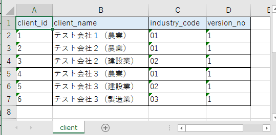
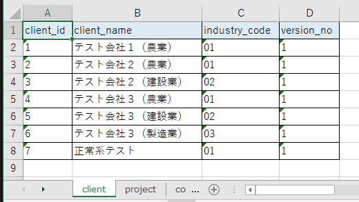

# 単体テストガイド(Web)

- [テスト単位](#テスト単位)
- [コンポーネントのテスト実施方法](#コンポーネントのテスト実施方法)
  - [テストデータ作成](#テストデータ作成)
    - [テストデータの配置場所](#テストデータの配置場所)
    - [データベース (テスト実施前)](#データベース-テスト実施前)
    - [SQLファイル (テスト実施前)](#sqlファイル-テスト実施前)
    - [データベース (期待値)](#データベース-期待値)
  - [テストコード作成](#テストコード作成)
    - [モジュール単位の自動テスト](#モジュール単位の自動テスト)
- [Formの自動テスト実施方法](#formの自動テスト実施方法)
  - [テストコード作成](#テストコード作成-1)
    - [リクエストを送信する](#リクエストを送信する)
    - [エラーメッセージを検証する](#エラーメッセージを検証する)
- [打鍵テスト実施方法](#打鍵テスト実施方法)
  - [テストデータを準備する](#テストデータを準備する)
  - [テストデータを登録する](#テストデータを登録する)
  - [アプリケーションの起動と停止](#アプリケーションの起動と停止)
    - [カバレッジの取得](#カバレッジの取得)
  - [テストを実施する](#テストを実施する)
    - [楽観排他制御のテスト](#楽観排他制御のテスト)
    - [二重送信防止のテスト](#二重送信防止のテスト)

## テスト単位

Web画面の単体テストは自動テストおよび打鍵テストで実施する。

自動テストを行う対象は`Form`と【030_アプリ設計/020_共通コンポーネント設計/共通コンポーネント設計書】を作成したクラスである。
`Form`の自動テストでは通常の打鍵オペレーションでは入力・送信ができないケースを実施する。

自動テストに関して、1つの【030_アプリ設計/110_テスト仕様書/単体テスト仕様書】につき1つのテストクラスを作成する。
可読性を向上させるため、なるべく1つのテストメソッドにつき1つのテスト観点のみを確認するよう実装すること。

## コンポーネントのテスト実施方法

### テストデータ作成

#### テストデータの配置場所

テストデータは`src/test/resources`の配下に配置する。
`[テスト対象のパッケージ階層]/[テストクラス名]/[テストメソッド名]`というディレクトリを作成しテストデータを配置する。
複数のテストメソッドで共通で利用したいテストデータについては、`[テスト対象のパッケージ階層]/[テストクラス名]`に配置する。

`com.example.web.project.service.ProjectCommonService`という`Service`をテストする`ProjectCommonServiceTest`というテストクラスの`testSelectAllDepartment`というテストメソッドの場合、テストデータは以下のように配置する。

```shell
src
  ├ main
  │   └ java
  │       └ com
  │           └ example
  │               └ web
  │                   └ project
  │                       └ service
  │                           └ ProjectCommonService           #テスト対象のService
  └ test
      └ resources
           └ com
               └ example
                   └ web
                       └ project
                           └ service
                               └ ProjectCommonServiceTest                      #テストクラス名
                                   ├ testSelectAllDepartment                   #テストメソッド名
                                   │   ├ testSelectAllDepartment.xlsx          #テストデータ
                                   │   └ expected-testSelectAllDepartment.xlsx #テストデータ
                                   └ reset_sequence_val.sql                    #テストデータ(共通)
```

#### データベース (テスト実施前)

データベースをセットアップする必要がある場合に作成する。
テストデータは[Database Rider](https://database-rider.github.io/database-rider/)というツールによってデータベースに投入される。

- `client`テーブルをセットアップするテストデータの例。

    

    - テストデータ作成のポイント
        - Excelで作成する
        - 全セル文字列形式とする
        - ファイル名は`[対象のテストメソッド名].xlsx`とする
        - 1シートにつき1テーブルずつデータを記載し、シート名はテーブル名とする
        - 各シートの1行目にはカラム名を記載する
        - カラムを省略した場合はそのカラムの値は`null`となる
        - 項目に`null`を設定したい場合は、`[null]`と入力する

#### SQLファイル (テスト実施前)

テスト実行前に実行したいSQLが存在する場合に作成する。
シークエンスのリセットのためALTER文を発行したい場合などに使用する。

- SQLファイル(テスト実施前)の例

    ```sql
    alter sequence public.client_client_id_seq restart with 7;
    ```

    - SQLファイル作成のポイント
        - ファイル名は、内容が分かるように命名する

#### データベース (期待値)

テスト実施後のデータベースの状態を検証する場合に作成する。
テストデータは[Database Rider](https://database-rider.github.io/database-rider/)というツールによって検証される。

- `client`テーブルを検証するテストデータの例。

    

    - テストデータ作成のポイント
        - Excelで作成する
        - 全セル文字列形式とする
        - ファイル名は`expected-[対象のテストメソッド名].xlsx`とする
        - 1シートにつき1テーブルずつデータを記載し、シート名はテーブル名とする
        - 各シートの1行目にはカラム名を記載する
        - カラムを省略した場合はそのカラムは検証対象外となる
        - 項目に`null`を設定したい場合は、`[null]`と入力する

### テストコード作成

#### モジュール単位の自動テスト

コンポーネント(【030_アプリ設計/020_共通コンポーネント設計/共通コンポーネント設計書】を作成したクラス)につき1つのテストクラスを作成する。
実装例は次の通り。

```java
@SpringBootTest // (1)
@DBRider // (2)
@DBUnit(replacers = {SystemDateTextReplacer.class}, cacheConnection = false, caseSensitiveTableNames = true) // (2)
@WebTest // (3)
class ProjectCommonServiceTest {

    private static final String BASE_PATH = "com/example/web/project/service/ProjectCommonServiceTest/";
    
    @Autowired // (4)
    ProjectCommonService sut;

    @Test
    @DataSet(BASE_PATH + "testSelectAllDepartment/testSelectAllDepartment.xlsx") // (5)
    @ExpectedDataSet(BASE_PATH + "testSelectAllDepartment/expected-testSelectAllDepartment.xlsx") // (6)
    void testSelectAllDepartment(){ // (7)
        // (8)
        List<OrganizationDto> actual = sut.selectAllDepartment();
        List<OrganizationDto> expected = ... // 期待値の組み立てコードは省略
        assertThat(actual).isEqualTo(expected);
    }
}
```

- 実装のポイント
    - (1)`@SpringBootTest`をつける。これによりテスト対象のコンポーネントをテストクラスにインジェクションできるようになる
    - (2)データベースのセットアップ/検証を行う場合は`@DBRider`と`@DBUnit(replacers = {SystemDateTextReplacer.class}, cacheConnection = false, caseSensitiveTableNames = true)`をつける
    - (3)テスト用の不要なクラスが起動されないように`@WebTest`をつける
    - (4)テスト対象のコンポーネントをインジェクションする
    - (5)データベースのセットアップを行うには`@DataSet`をつける。[データベース (テスト実施前)](#データベース-テスト実施前)で作成したテストデータを`src/test/resources`からの相対パスで指定する
    - (6)データベースの検証を行うには`@ExpectedDataSet`をつける。[データベース (期待値)](#データベース-期待値)で作成したテストデータを`src/test/resources`からの相対パスで指定する
    - (7)テストメソッド名は「`test` + テストで確認している観点がわかる論理的な名前」とする
    - (8)【030_アプリ設計/110_テスト仕様書/単体テスト仕様書】のケースに沿ってテストコードを実装する

## Formの自動テスト実施方法

### テストコード作成

```java
@SpringBootTest // (1)
@Import(ValidationTestBase.SessionRepositoryConfiguration.class) // (2)
@WebTest // (3)
@AutoConfigureMockMvc // (4)
public class ProjectCreateFormTest extends ValidationTestBase { // (5)(6)

    // (7)
    private static final String CONFIRM_PATH = "/project/create/confirm";
    private static final String EXECUTE_PATH = "/project/create/execute?execute";
    private static final String FORM_NAME = "projectCreateForm";
    private static final String TOKEN_NAME = "project/create";

    @Test // (8)
    @WithMockUser(authorities = "PROJECT_MANAGER") // (9)
    void testConfirmRequired() throws Exception {
        // 内容は後述
    }
```

- 実装のポイント
    - (1) `@SpringBootTest`を付ける
    - (2) `@Import(ValidationTestBase.SessionRepositoryConfiguration.class)`を付ける
    - (3) `@WebTest`を付ける
    - (4) `@AutoConfigureMockMvc`を付ける
    - (5) テストクラス名はテスト対象の`Form`のクラス名に`Test`を付けたものとする
    - (6) `ValidationTestBase`を継承する。`ValidationTestBase`には`Form`の自動テストで使用する共通の処理が定義されている
    - (7) いくつかの定数を定義する
        - `XXX_PATH`には「確認」や「登録」といった画面のイベントに対応するURLを設定する（`XXX`にはイベントを表す名前を付ける）。URLはルートからの相対パスとする
        - `FORM_NAME`にはテスト対象となる`Form`の名前を設定する。`Form`の名前はクラスの単純名をlowerCamelCaseにしたものとする
        - `TOKEN_NAME`には二重サブミット防止のため`Controller`のクラスに付けた`@TransactionTokenCheck`で設定した名前を設定する
    - (8) テストメソッドには`@Test`を付ける。テストメソッド名は「`test` + テストで確認している観点がわかる論理的な名前」とする。テストの内容については後述する
        - パラメータ化テストを行う場合は`@Test`ではなく`@ParameterizedTest`を付ける。詳しくはJUnit 5のマニュアルを参照すること
    - (9) ログイン認証をモック化するために`@WithMockUser`を付ける
        - また、必要に応じて`authorities`に権限を設定する。自動テストはここで設定した権限を付与して実行される

#### リクエストを送信する

リクエストを送信する方法は次の通り。

```java
// (1)
mvc
        .perform(post(CONFIRM_PATH)
                .param("divisionId", "1") // (2)
                .param("projectName", "テスト") // (2)
                .param("projectStartDate", "2022-06-07") // (2)
                .with(csrf()) // (3)
                .with(transactionToken(TOKEN_NAME))); // (4)
```

- 実装のポイント
    - (1) 基底クラスに定義されているフィールド`mvc`を用いてモックリクエストを送信する
        - `POST`リクエストの場合は`post`メソッドにURLを渡してリクエストを構築する
        - `GET`リクエストの場合は`get`メソッドにURLを渡してリクエストを構築する
    - (2) `param`メソッドでフォームパラメータを設定する
    - (3) `POST`リクエストの場合はCSRFトークンを送信する必要があるが、テスト時は`with(csrf())`とすることでダミーのCSRFトークンを送信できる
    - (4) 二重送信を防止している場合はトークンを送信する必要があるが、テスト時は`.with(transactionToken(TOKEN_NAME))`とすることでダミーのトークンを送信できる
        - 二重送信を防止していない場合は不要（検索処理、確認画面への遷移処理など）

#### エラーメッセージを検証する

```java
MvcResult mvcResult = mvc // (1)
        .perform(post(EXECUTE_PATH)
                .with(csrf())
                .with(transactionToken(TOKEN_NAME)))
        .andReturn(); // (1)

// (2)
BindingResult bindingResult = getBindingResult(mvcResult, FORM_NAME);
// (3)
assertEquals("入力してください。", getErrorMessage(bindingResult, "divisionId"));
```

- 実装のポイント
    - (1) `andReturn`メソッドを呼び出して戻り値を`MvcResult`型の変数へ代入する
    - (2) 基底クラスに定義されている'getBindingResult'を呼び出して`BindingResult`のインスタンスを取得する
    - (3) 基底クラスに定義されている`getErrorMessage`メソッドを呼び出してエラーメッセージを検証する

## 打鍵テスト実施方法

### テストデータを準備する

打鍵テストで使用するテストデータを準備する。

単体テスト用データダンプツールには、ダンプしたデータをDBにインサートしなおす機能がある。
したがって、テストで使用するデータをあらかじめダンプツールで抽出しておけば、ダンプツールのインサート機能を使って何度でも同じデータで取引単体テストを行えるようになる。

以下で、インサート用のテストデータを作成する手順を説明する。

まず、手動でDBをテスト直前の状態にする。
そして、ダンプツールを使用してテスト前のDBのダンプを取得する。
ダンプの取得方法については[エビデンスの取得方法（ログとDBダンプ）](エビデンスの取得方法（ログとDBダンプ）.md)を参照すること。

ダンプファイルが作成できたら、以下の手順でテストデータ登録用のファイルを作成する。

1. ダンプツールのExcelファイル（DUMP.xlsm）を開き、テーブル定義一覧を更新する（手順は[エビデンスの取得方法（ログとDBダンプ）](エビデンスの取得方法（ログとDBダンプ）.md)を参照）
1. MAINシートを開きデータを挿入するテーブルについて挿入列を「○」に変更する
1. テスト直前の状態を抽出したダンプファイルを開き、挿入対象のテーブルをDUMP.xlsmのINSERTシートにコピーする（INSERTシートに記載する内容については、使い方.xlsxを参照）

以上で、テストデータの登録準備は完了。

### テストデータを登録する

1. INSERTシートにテストデータを記載したDUMP.xlsmを開き、MAINシート画面上部の「起動」をクリックする
1. ダンプツールのウインドウが表示されます。表示されたウインドウの「インサート」をクリックする

### アプリケーションの起動と停止

次のコマンドでアプリケーションを起動する。

```bash
mvn jacoco:prepare-agent spring-boot:run -Djacoco.propertyName="spring-boot.run.jvmArguments" -Dspring-boot.run.arguments="--logging.file.name=target/app.log"
```

#### カバレッジの取得

JaCoCoを使用してカバレッジを取得できるようにしている。
このコマンドでアプリケーションを起動し、テストを実施してから`Ctrl + C`でアプリケーションを停止すること。

カバレッジの計測値は`target/jacoco.exec`に書き込まれる。
カバレッジ取得をやり直したい場合はアプリケーションを停止してから`target/jacoco.exec`を削除して再度アプリケーションを起動すること。

テストを実施し終えたら次のコマンドで`target/jacoco.exec`からカバレッジレポートを出力する。

```bash
mvn jacoco:report
```

カバレッジレポートは`target/site/jacoco`に出力されるため、テスト対象機能に関するレポートを確認および保管すること。

### テストを実施する

ブラウザを開いて打鍵テストを実施していく。

以下に、いくつかの特徴的なパターンについてテスト実施方法を説明する。

#### 楽観排他制御のテスト

楽観排他制御のテストを行うためには故意に楽観排他エラーを起こす必要がある。

まずブラウザを2つ起動し、両方のブラウザで対象レコードの更新処理を確認画面まで進める。

片方のブラウザを完了画面まで進める。

もう片方のブラウザを完了画面まで進めようとすると、対象レコードが既に更新されているため、楽観排他エラーとなる。

#### 二重送信防止のテスト

二重送信防止のテストを行うためには故意に二重送信を行う必要がある。

まず対象レコードの更新処理を確認画面まで進める。

次に`Ctrl`キーを押しながら完了画面へ進めるためのボタンを押下する。
そうすると完了画面が別タブで開く。

別タブで完了画面が開いたことを確認したら、もとの確認画面へ戻って今度は`Ctrl`キーを押さずに完了画面へ進めるためのボタンを押下する。
先の操作で二重送信防止トークンは消費されているため、二重送信エラーとなる。
